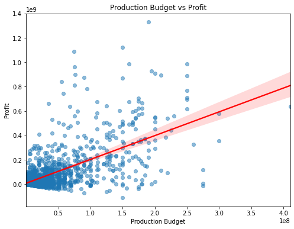

**MOVIE INDUSTRY STRATEGIC ANALYSIS**

## OVERVIEW
The project analyses different types of films from movie datasets to help the head of the company decide on the type of the film to create in the new movie studio.The project analysis will focus on establishing the best performing films in the industry based on the data provided. We analyzeover 10 years of historical data to determine which factors—specifically Genre, Production Budget, and Release Timing—drive the highest Return on Investment (ROI) and total worldwide revenue.

**Methodology**
Our team utilized a structured Data Science workflow:

Data Cleaning:Standardizing currency, handling missing values, and formatting dates.

Exploratory Data Analysis (EDA):Visualizing trends in profitability across genres and time.

## Business Understanding
The company wants to enter the movie industry, but they lack experience. The goal of this project is to analyze existing movie data to identify patterns of success and guide decision-making for the new studio

## Key Business Questions
Genre Selection: Which film genres consistently outperform others in terms of revenue?

Budget Optimization: Is there a "sweet spot" for production budgets that balances risk and reward?

Market Timing: When is the most profitable time of year to release a new feature film?

## Goal
Provide data-driven recommendations so the company can:

Reduce risk when investing in movies

Choose the right type of films

Maximize profit and audience reach

## Datasets source
We used three main data sources:
1.[bom.movie_gross.csv.gz](zippedData/bom.movie_gross.csv.gz)-it shows gross revenue (movies that made the most revenue,studios that produced the highest films)

2.[im.db.zip](zippedData/im.db.zip)-shows the movie genres produced,runtime,year,title and ratings.

3.[tn.movie_budgets.csv.gz](zippedData/tn.movie_budgets.csv.gz)-shows has the movies production budgets,therefore we use to determine the cost and return on investment

## Tools and Technologies

**Python** – Data cleaning, analysis, and visualization   
**Pandas & NumPy** – Data manipulation and computation  
**Matplotlib & Seaborn** – Data visualization  
**SQLite3** – Accessing IMDb database tables  
**VS Code** – Development environment  

## Data preparation
Data preparation is a crucial step to ensure accurate analysis. The following steps were performed:
 ### Data Loading
 -Imported CSV datasets using Pandas,
 -Connected to the IMDb SQLite database using SQLite3:
 ### Data Inspection
 -Checked column names, data types, and first few rows.
 -Identified missing values, duplicates, and inconsistent entries.
 ### Handling Missing Value
 -Replaced and removed missing values depending on the column
 ### Data cleaning
-Removed duplicates
-Establishing data types
-Standadizing Data Formats
 ### Data Intergration
 -Merged datasets using common keys(title,movie id and release year)

## Final Data
_After cleaning and merging, the final dataset contained all relevant columns for analysis:
Movie title, year, genre, production company, budget, gross, IMDb rating, profit, profit ratio.
 
## Data Analysis and Visualization
After preparing the data, several analyses and visualizations were conducted to extract insights about the movie industry.The main focus was on **budgets, revenue, profitability, genres, and trends over time

-Insight: Profit Distribution Among Top 10 Movies

The bar chart reveals that profitability among the top 10 movies is not evenly distributed. A number of movies generate higher profits compared to the rest.

Although all selected movies are high-performing, the visible gaps between profit levels suggest that there is competition even in the top-tier group. This means that for high profits, the productions should standout due to competitive nature in performances.

-We analyze the median profit by month to identify the best "Release Windows.

-The graph above analyzes the top 10 production studios in gross profit between 2010 to 2018. This shows the best peformers in the film industry, where our company can focus on the type of films they produce.

-We use a redplot to see the "Line of Best Fit." This helps us understand if spending an extra $10M actually results in more revenue.s.
Insight: There is a "diminishing return" on very high budgets. The most consistent success happens in the $30M–$70M range.

-The graph above analyses the total revenue generated by different movies over time.From the graph there is an increasing trend in the revenue from 2010 to 2016 however from 2017 the revenue declines.This implies that revenue should not solemnly be used in determining the genre to invest in.

## Recommendations
1. Invest in High-Impact Productions  
   Since profits are concentrated among a few standout films, studios should prioritize projects with strong market potential, such as established franchises, sequels, or films with proven audience appeal.

2. Leverage Data-Driven Decision Making 
   Use historical profit data, genre trends, audience preferences, and release timing analysis to guide production and marketing strategies.

3. Optimize Marketing Strategies 
   Given the large profitability gap, aggressive and well-targeted marketing campaigns can help elevate a film’s performance into the highest profit tier.

4. Diversify Investment Portfolio  
   While aiming for blockbuster hits, studios should balance risk by investing in a mix of high-budget and mid-budget films to ensure more stable overall returns.

5. Analyze Key Success Drivers  
   Further analysis should be conducted on factors such as genre, production budget, release season, and star power to understand what differentiates the highest-profit films from the rest.

## Conclusion
Analysis of box office data (primarily 2010–2018) reveals that Action, Adventure, Sci-Fi, and Animation genres consistently deliver the highest worldwide revenue and strongest international performance. Family animation and franchise-driven action-adventure films show particularly reliable returns, while mid-budget projects in the $25–60 million range achieve the best risk-adjusted ROI. Extremely high-budget films (> $150 M) produce both massive hits and costly flops, making disciplined budgeting essential.
Release timing strongly influences success: the May–July summer window and November–December holiday period generate the highest median profits due to school breaks, family audiences, and gift-giving seasons. Off-peak months (January–February, August–September) are best reserved for smaller releases, counter-programming, or streaming-focused titles.
Strategic recommendation: Build a core slate of 2–3 $40–70 million action-adventure or family animation films per year targeting summer and holiday windows, supplemented by 3–5 lower-budget ($10–40 M) projects for diversification and strong ancillary/streaming revenue. Selective $100 M+ tentpoles should only be pursued with proven franchise value, global star power, and robust international pre-sales. This balanced approach maximizes theatrical upside while controlling financial risk in a competitive market.